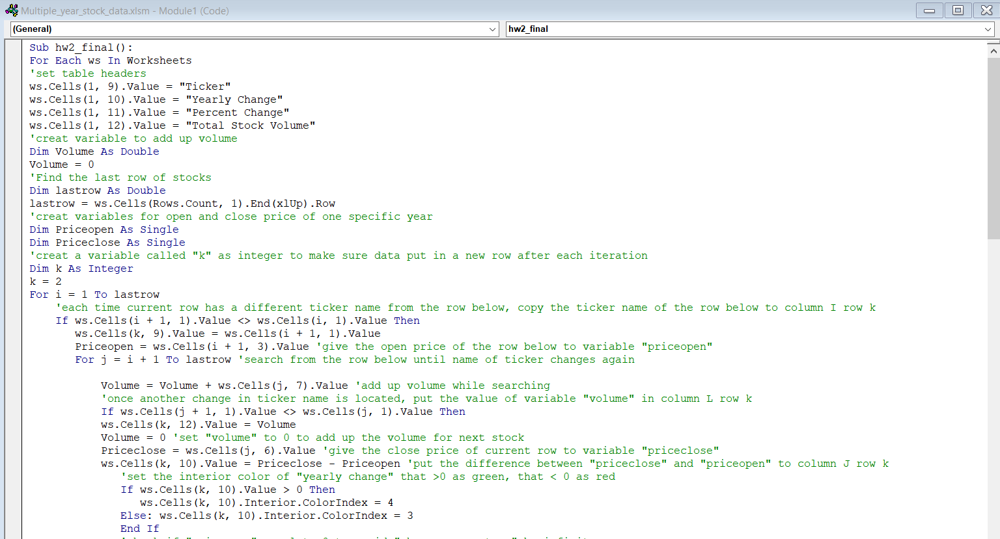
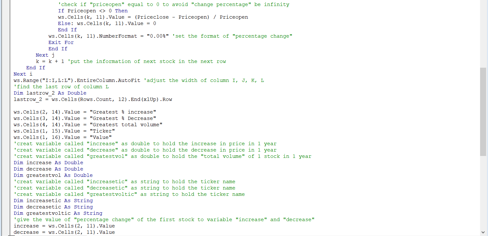
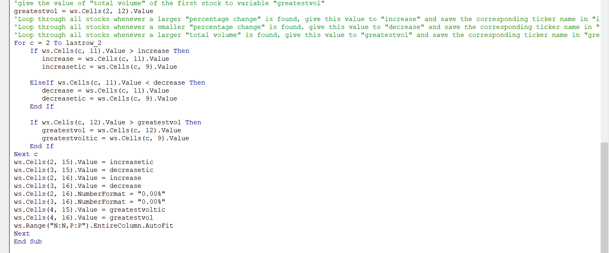
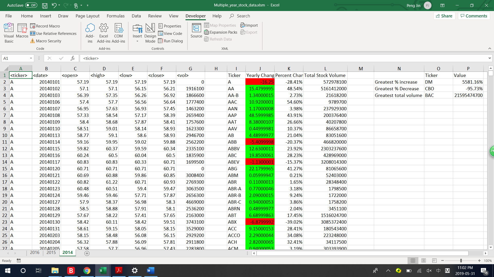
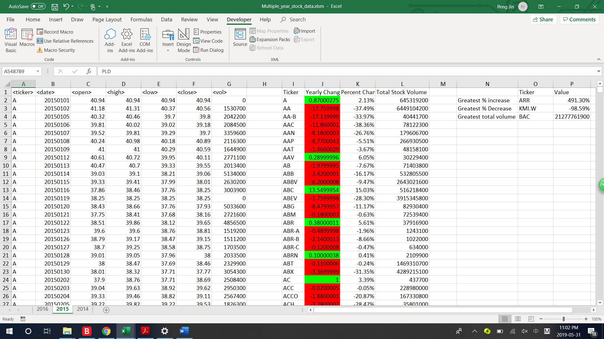
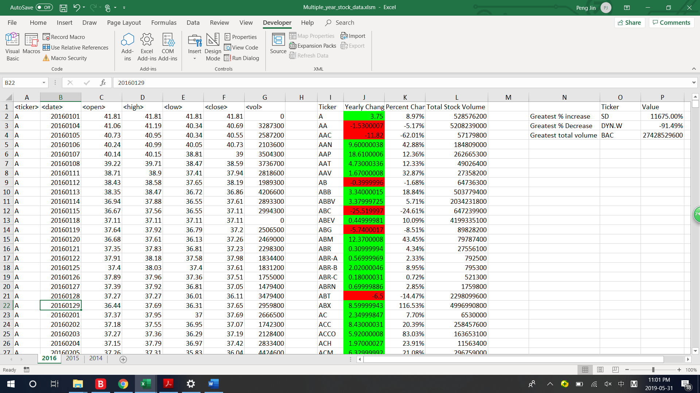

# The VBA of Wall Street - Stock Market Analysis
Build VBA scripts in Excel to loop through 3 worksheets of real stock market data in 2014, 2015, 2016, and for each sheet create a summary table with the following information:
  * The ticker symbol.

  * Yearly change from opening price at the beginning of a given year to the closing price at the end of that year.

  * The percent change from opening price at the beginning of a given year to the closing price at the end of that year.

  * The total stock volume of the stock.

  * Conditional formatting that will highlight positive change in green and negative change in red.
  
Also, in each sheet, find the 3 stocks that see the greatest increase, decrease in price and largest exchange volume, respectively. 

VBA scripts

The result after running the scripts are as follow:

 
 
 
